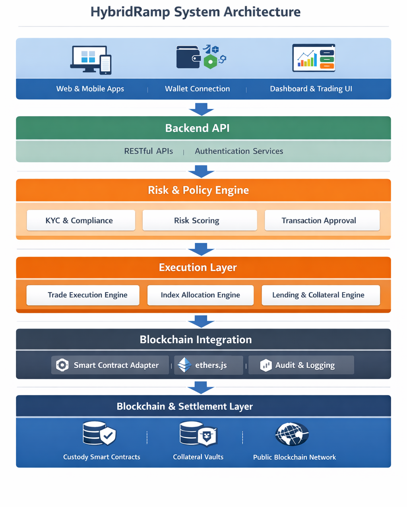
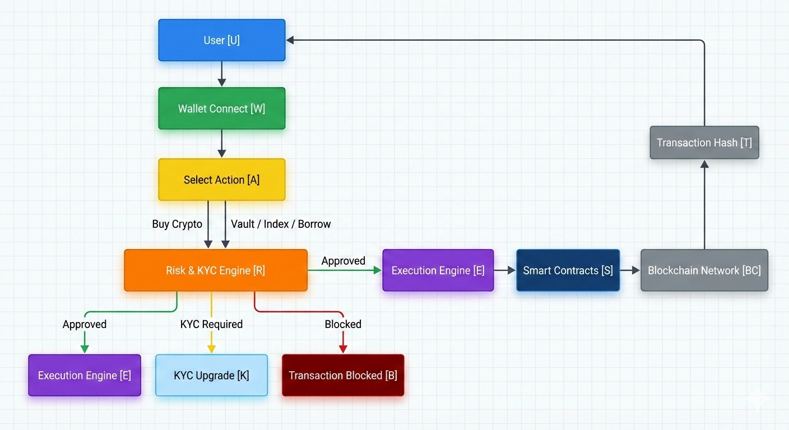
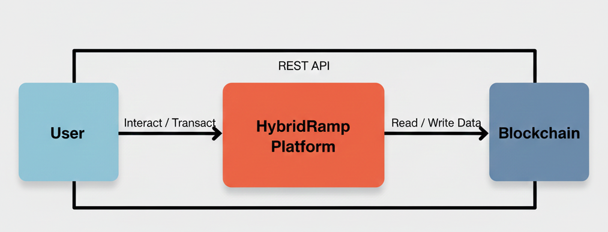
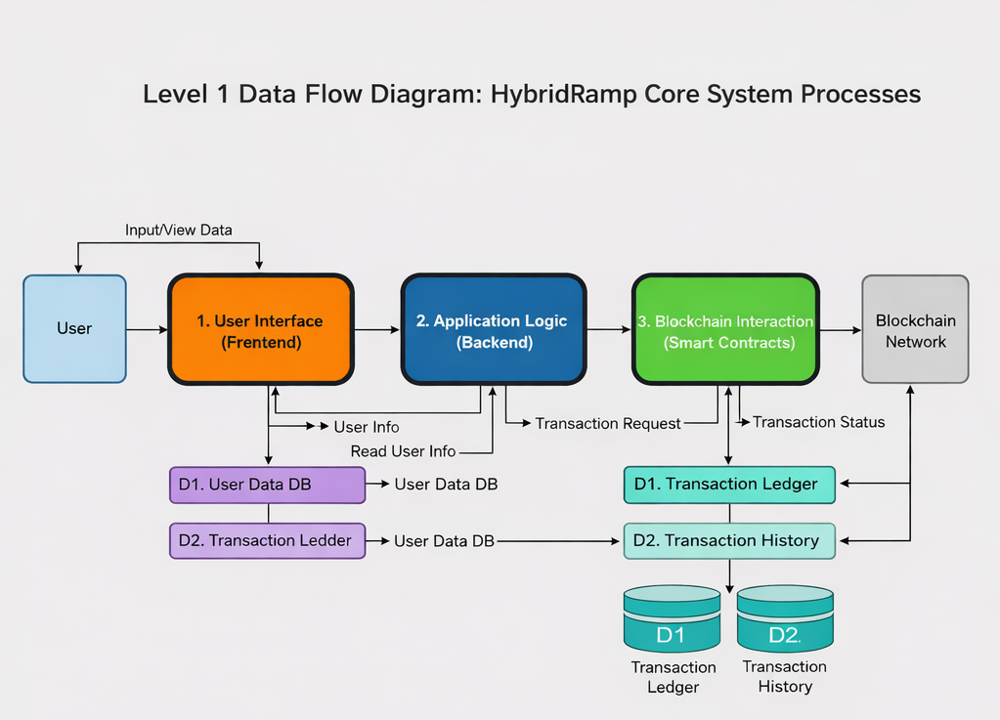
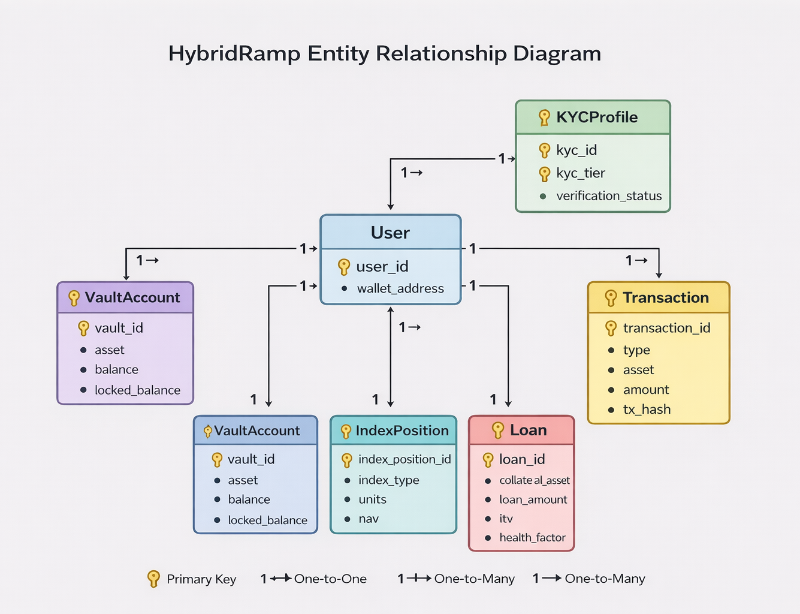

# HybridRamp
**HybridRamp** is a **FinTech platform with Web3 settlement** that acts as an **intermediary execution and custody layer** for user crypto transactions. It enforces risk controls, routes orders intelligently, offers index-style exposure and crypto-backed lending, and settles ownership on blockchain.

### Target Users

- Indian stock investors new to crypto
- Risk-averse retail users
- Users seeking passive crypto exposure
- Crypto holders needing short-term liquidity without selling


## Table of Contents

1. Overview  
2. Problem Statement  
3. Solution Approach  
4. Innovation Highlights  
5. Key Features  
6. System Architecture  
7. User Workflow  
8. Data Flow Diagrams (DFDs)  
9. Database Schema  
10. Entity Relationship Diagram  
11. Technical Workflows  
12. Production-Ready vs Simulated Components
13. Improvements for Round 2  


---

## Problem Statement

### The Indian Crypto Barrier

India has 22M retail investors (NSE/BSE), but < 1M trade crypto because:

1. Onboarding friction

   - Binance: "Create account, enable 2FA, pass KYC, install cold wallet"

   - Result: 70% drop-off before first trade

2. Execution risk

   - User enters "buy 0.01 BTC" → doesn't know about slippage

   - Gets 0.008 BTC instead → loses ₹5k without understanding why

   - Assumes platform is fraud; never returns

3. Compliance fear

   - "Is crypto legal in India?" (Answer: gray area, unregulated)

   - "Will I pay tax?" (Answer: yes, 30% crypto gains tax + TDS)

   - "Will the government freeze my account?" (Answer: low risk, but unclear)

   - Result: Newbies don't invest; miss 300% gains in bull cycles

4. No simple exposure

   - Stock investor can buy "Sensex Index Fund" (Nifty 50)

   - Crypto investor must pick individual coins (BTC, ETH, ...) = mental overhead

   - No "top 5 crypto fund" equivalent

5. No credit products

   - Holds ₹10L BTC; needs ₹50k cash for wedding

   - Options: (a) Sell BTC (taxable), (b) Take personal loan (15% interest)

---
# Solution Approach


### HybridRamp Model

HybridRamp is an **India-first crypto financial platform** designed to treat crypto like a **regulated investment and asset class**, not a speculative trading tool.

Instead of pushing complexity to users, HybridRamp **absorbs execution, custody, risk, and compliance complexity at the system level**, similar to how Indian stock brokers and banks operate.


### Approach

1. **Simplified Onboarding**

- INR-first guided flow (buy, invest, borrow)
- Automatic KYC tiering and transaction limits
- No requirement for crypto-native knowledge

3. **Smart Execution Engine**

- Small transactions execute instantly
- Large transactions are automatically split and routed
- Simulated multi-venue price comparison minimizes slippage

5. **On-Chain Settlement**

- Real ERC-20 smart contracts deployed on testnet
- Token minting and transfers occur on-chain
- Every transaction is verifiable via blockchain explorer

7. **Secure Custodial Vault**

- Platform-controlled vault for safe asset storage
- Backend tracks user ownership
- Policy-based withdrawals with simulated multi-signature approval

9. **Crypto Index / Basket Investment**

- Nifty50-like crypto baskets with fixed allocation
- NAV calculated transparently using simulated prices
- Enables diversified crypto exposure without coin selection

11. **Crypto-Backed Lending**

- Users borrow fiat against locked crypto collateral
- Loan-to-Value (LTV) enforced
- Collateral locking and liquidation logic simulated on-chain

13. **Compliance-First Design**

- Tier-based KYC aligned with Indian practices
- Automated crypto tax and TDS estimation logic
- Full audit trail for reporting and transparency

#### Innovation Highlights

| **Aspect**    | **Standard Crypto Platforms** | **HybridRamp Innovation**            |
| ------------- | ----------------------------- | ------------------------------------ |
| Onboarding    | Crypto-native, complex        | INR-first, guided, tier-based        |
| Execution     | Manual market orders          | Smart routing with slippage control  |
| Trust         | Centralized database balances | Blockchain-backed proof of ownership |
| Custody       | Fully custodial or DIY        | Hybrid custody with vault controls   |
| Investing     | Individual coin trading       | Index-style crypto baskets           |
| Liquidity     | Must sell crypto              | Borrow against crypto collateral     |
| Compliance    | User responsibility           | Built-in tax & audit logic           |
| Platform Type | Trading app                   | Crypto financial infrastructure      |


--- 


## Key Features

## 1. Wallet-Based User Onboarding

- MetaMask wallet connection
    
- Wallet address acts as user identity (no passwords)
    
- Network validation (testnet)
    

**Value:** Simple, secure onboarding without traditional credentials.

---

##  2. Fiat → Crypto On-Ramp (Mocked)

- Users can buy crypto using fiat (UPI / card simulated)
    
- Payment success is mocked for legality
    
- Triggers real blockchain settlement
    

**Value:** Low-friction crypto entry for non-technical users.

---

## 3. Tier-Based KYC System (Mocked but Logical)

- **Tier 1:** Email / phone (default)
- verify email and phone via otp
    
- **Tier 2:** ID upload (mock)
    
- **Tier 3:** Full KYC (mock)
    

Transaction limits and feature access depend on tier.

**Value:** Compliance-aware design inspired by real FinTech platforms.

---

##  4. Risk-Based Decision Engine 

- Dynamic risk scoring based on:
    
    - Transaction amount
        
    - KYC tier
        
    - Wallet behavior (mocked)
        
- Outcomes:
    
    - Approved
        
    - KYC upgrade required
        
    - Blocked
        

**Value:** Prevents fraud and unsafe transactions through intelligent checks.

---

##  5. Smart Execution Engine 

- Differentiates between:
    
    - Small instant transactions
        
    - Large transactions requiring smart routing
        
- Simulates price comparison across multiple liquidity sources
    
- Minimizes slippage for large orders
    

**Value:** Institutional-grade execution logic in a consumer product.

---

## 6. On-Chain Settlement (REAL)

- ERC-20 token smart contract deployed on testnet
    
- Real token minting and transfers
    
- Transactions verifiable on blockchain explorer
    

**Value:** Transparency and trust through blockchain settlement.

---

## 7. Secure Crypto Vault (Custodial Storage)

- Users can move crypto from wallet into platform vault
	    
- Vault is platform-controlled with policy-based withdrawal
    
- Backend tracks user ownership
    
- Withdrawal requires additional checks / approval (simulated multi-sig)
    

**Value:** Safer storage option for large balances (BitGo-style custody).

--- 

## 8. Crypto Index 

- Index's created like Nifty 50, Nifty 100
    
- Fixed asset allocation (e.g. BTCx, ETHx, Stable)
    
- Users receive a fund token representing ownership
    
- NAV calculated using simulated prices
    

**Value:** Simplified, risk-managed crypto investing for beginners.

---

## 9. Crypto-Backed Lending 

- Users borrow against locked crypto collateral
    
- Loan-to-Value (LTV) enforced
    
- Collateral locked on-chain
    
- Liquidation logic simulated
    

**Value:** Demonstrates DeFi credit mechanics with FinTech controls.

---

## System Architecture

### High-level architecture diagram :




# HybridRamp Architecture Overview

HybridRamp follows a **layered architecture pattern** with **six distinct layers**, each responsible for a specific concern in the system.

---

## 1. Presentation Layer

**Purpose:** User-facing interfaces and wallet connectivity

- Multi-platform web and mobile applications
    
- Web3 wallet integration
    
    - MetaMask
        
    - WalletConnect
        
    - Other EVM-compatible wallets
        
- Real-time trading dashboard
    
- Analytics and portfolio visualization UI
    

> [!note]  
> This layer focuses purely on UX/UI and user interaction, with no business logic.

---

## 2. Backend API Layer

**Purpose:** Secure communication and orchestration layer

- RESTful API services
    
- OpenAPI / Swagger documented endpoints
    
- JWT-based authentication and authorization
    
- Rate limiting and request throttling
    
- Input validation and schema enforcement
    

> [!important]  
> Acts as the gateway between clients and internal services.

---

## 3. Risk & Policy Engine

**Purpose:** Compliance-first automated risk management

- KYC / AML integration
    
- Identity verification workflows
    
- Multi-factor risk scoring algorithms
    
- Configurable transaction approval rules
    
- Policy-based enforcement engine
    

> [!warning]  
> This layer determines whether a transaction is allowed before execution.

---

## 4. Execution Layer

**Purpose:** Core financial operations and business logic

### Components

- **Trade Execution Engine**
    
    - Order matching
        
    - Trade execution
        
- **Index Allocation Engine**
    
    - Automated portfolio rebalancing
        
    - Index weight calculations
        
- **Lending & Collateral Engine**
    
    - Loan origination
        
    - Collateral management
        
    - Liquidation logic
        

> [!tip]  
> This layer is chain-agnostic and focuses purely on financial logic.

---

## 5. Blockchain Integration Layer

**Purpose:** Bridge between backend services and blockchain networks

- Smart contract interaction adapters
    
- ethers.js integration for Ethereum compatibility
    
- Transaction signing and submission
    
- Event listeners and indexers
    
- Comprehensive audit logging
    

> [!abstract]  
> This layer abstracts blockchain complexity from core services.

---

## 6. Blockchain & Settlement Layer

**Purpose:** On-chain settlement and custody

- Non-custodial smart contract vaults
    
- On-chain collateral management
    
- Settlement finality
    
- Multi-chain support:
    
    - Ethereum
        
    - Polygon
        
    - Arbitrum
        

> [!success]  
> Ensures trustless settlement and transparency.

---

## Architecture Flow (High-Level)

```text
Presentation Layer
        ↓
Backend API Layer
        ↓
Risk & Policy Engine
        ↓
Execution Layer
        ↓
Blockchain Integration Layer
        ↓
Blockchain & Settlement Layer
```


---


## User Flow 




---

##  Data Flow (DFDs)

### Level 0 – Context



### Level 1 – Detailed



---
## Database Schema (High-Level)

###  Design Principles

- Wallet-based identity (no usernames or passwords)
    
- Immutable transaction records
    
- Clear separation of user state and financial actions
    
- Audit-first design
    
- Blockchain-aware but not blockchain-dependent
    

---

###  Core Data Entities

```
User
 ├── KYCProfile
 ├── Transactions
 ├── VaultAccount
 ├── IndexPosition
 └── Loan
```

---

###  User

Represents a platform user identified by wallet address.

**Attributes**

- `user_id` – internal identifier
    
- `wallet_address` – blockchain wallet address
    
- `status` – active / suspended
    
- `created_at` – account creation timestamp
    

> Wallet address is the primary identity. No credentials are stored.

---

###  KYC Profile

Tracks verification tier and compliance status.

**Attributes**

- `kyc_id`
    
- `user_id`
    
- `kyc_tier` (Tier 1 / Tier 2 / Tier 3)
    
- `verification_status`
    
- `updated_at`
    

Used by the **Risk & Policy Engine** to enforce limits and feature access.  
(KYC is mocked in the prototype.)

---

###  Transaction

Represents any user-initiated financial action.

**Attributes**

- `transaction_id`
    
- `user_id`
    
- `type` (Buy / Vault / Index / Borrow)
    
- `asset`
    
- `amount`
    
- `risk_score`
    
- `status`
    
- `tx_hash` (blockchain reference)
    
- `created_at`
    

Transactions are **immutable** once completed and serve as audit records.

---

###  VaultAccount

Tracks custodial balances stored in the platform vault.

**Attributes**

- `vault_id`
    
- `user_id`
    
- `asset`
    
- `balance`
    
- `locked_balance`
    
- `updated_at`
    

Actual custody is enforced **on-chain**.  
The database tracks ownership and withdrawal state.

---

### IndexPosition

Represents user exposure to a crypto market index (NIFTY-style).

**Attributes**

- `index_position_id`
    
- `user_id`
    
- `index_type`
    
- `units`
    
- `nav`
    
- `created_at`
    

Index allocation is **passive**, with NAV calculated using simulated prices.

---

###  Loan

Tracks crypto-backed lending positions.

**Attributes**

- `loan_id`
    
- `user_id`
    
- `collateral_asset`
    
- `collateral_amount`
    
- `loan_amount`
    
- `ltv`
    
- `health_factor`
    
- `status`
    
- `created_at`
    

Collateral locking is enforced **on-chain**, while loan health is monitored off-chain.

---

### Blockchain References

The database references blockchain state using:

- Wallet addresses
    
- Transaction hashes

---
###  Entity Relationships

|Relationship|Cardinality|
|---|---|
|User → KYCProfile|One-to-One|
|User → Transaction|One-to-Many|
|User → VaultAccount|One-to-Many|
|User → IndexPosition|One-to-Many|
|User → Loan|One-to-Many|

### ER Diagram 



---

##  Technical Workflows

### Buy Crypto (User Initiates Purchase)

1. User inputs amount
    
2. Frontend collects wallet address & amount
    
3. Backend Risk Engine computes risk score
    
4. If approved → Execution Engine decides routing
    
5. Blockchain Adapter submits transaction to smart contract
    
6. Token transfer executed on testnet
    
7. Tx hash returned to frontend
    

### Vault Deposit

1. User selects amount to vault
    
2. Risk & policy checks applied
    
3. Backend records custodial allocation
    
4. Tokens transferred into vault address
    
5. Withdrawal requests trigger re-approval checks
    

### Crypto Market Index

1. User selects index allocation
    
2. Risk check ensures eligibility
    
3. Index engine computes weights
    
4. Composite index token minted to user
    
5. Index NAV tracked (simulated)
    

### Crypto-Backed Lending

1. User chooses collateral amount
    
2. System locks collateral on blockchain
    
3. Loan is issued (mocked)
    
4. Health factor monitored
    
5. Liquidation logic simulated
    

---

##  Smart Contracts

- `ERC20Token.sol` – Standard token for settlement
    
- `Vault.sol` – Custody vault contract
    
- `CollateralLock.sol` – Collateral locking for lending
    
- (Deploy to Sepolia / Polygon Testnet)
    

Contracts implement:

- Secure transfer
    
- Event logging
    
- Ownership tracking

---

# Production-Ready vs Simulated Components

| Components                        | Status           |
| --------------------------------- | ---------------- |
| Wallet-based onboarding           | Production-Ready |
| Tiered KYC                        | Simulated        |
| Risk-based decision engine        | Production-Ready |
| Smart execution routing           | Simulated        |
| On-chain settlement (ERC-20)      | Production-Ready |
| Secure vault custody              | Simulated        |
| Crypto Market Index (NIFTY-style) | Simulated        |
| Crypto-backed lending             | Simulated        |

---
## Improvements for Round 2


**Objective**

Transition HybridRamp from a **proof-of-concept prototype** to a **production-ready, scalable, and India-compliant crypto financial platform**.

Round 2 focuses on:

- Live integrations
- Performance optimization
- Regulatory compliance
- Advanced product maturity
- Enterprise-grade security

**A. Performance & Scalability Enhancements**

|   |   |   |   |
|---|---|---|---|
|**Metric**|**Round 1**|**Round 2**|**Improvement**|
|Quote Latency|~500 ms (simulated)|~50 ms (cached)|~90% faster|
|Dashboard Load|~1.2 s|~200 ms|~80% faster|
|Concurrent Users|~100|10,000+|100× scale|
|Blockchain Throughput|Single RPC|Batched RPC|Higher efficiency|

**Implementation**

- Redis caching for venue quotes (short TTL)
- Batched blockchain RPC calls
- CDN for static frontend assets
- Kubernetes-based horizontal scaling

**B. Live Integrations (Replacing Mocked Components)**

|                  |             |                                                                           |
| ---------------- | ----------- | ------------------------------------------------------------------------- |
| **Component**    | **Round 1** | **Round 2**                                                               |
| Fiat On-Ramp     | Mocked      | Razorpay UPI integration                                                  |
| KYC Verification | Mocked      | Aadhaar / PAN eKYC                                                        |
| Market Data      | Simulated   | Live market data from major centralized exchanges (e.g., Binance, WazirX) |

**Outcome**

- Real INR deposits and withdrawals
- Real user verification
- Real-time market pricing

**C. India-First Compliance Improvements**

|   |   |
|---|---|
|**Area**|**Enhancement**|
|Crypto Tax|Automated 30% gain calculation|
|TDS|Auto 1% deduction on eligible withdrawals|
|Audit Trails|Transaction-wise immutable logs|
|Reporting|Exportable P&L and tax statements|

**Impact**

- Regulatory readiness
- Reduced compliance burden for users
- Increased trust for Indian retail investors

**D. Advanced Product Capabilities**

|**Feature**|**Description**|
|---|---|
|AI Investment Guidance|Model-driven buy/sell suggestions|
|Auto-DCA|Scheduled recurring investments|
|Portfolio Alerts|Price, rebalance, and risk notifications|
|Social Investing|Copy portfolios of top-performing users|

**E. Investment & Lending Enhancements**

|**Area**|**Round 2 Upgrade**|
|---|---|
|Index Funds|Automatic periodic rebalancing|
|Lending|Dynamic interest rates based on pool demand|
|Risk Monitoring|Continuous loan health factor checks|

**Result**

- Improved capital efficiency
- Passive income-like experience
- Reduced liquidation risk

**F. Security & Trust Upgrades**

|**Layer**|**Round 2 Enhancement**|
|---|---|
|Smart Contracts|Third-party security audit|
|APIs|OAuth2, rate limiting, WAF|
|Data Protection|AES-256 encryption at rest|
|Testing|External penetration testing|
|Risk Coverage|Cyber and custody insurance|

**G. Platform Expansion**

|**Area**|**Upgrade**|
|---|---|
|Mobile Access|Native Android & iOS apps|
|Notifications|Push alerts (Firebase)|
|Infrastructure|Multi-region deployment|
|Availability|99.99% uptime target|


**Project Setup & Run Instructions**

- **Prerequisites:**

- Node.js (v18+ recommended) and npm installed.
- Recommended tools: a terminal (PowerShell or Windows Terminal) and a modern browser (Chrome/Edge/Firefox).
- Optional: yarn, pnpm or bun if you prefer (project contains bun.lockb).

- **Install dependencies (from project root):**  
    Open PowerShell and run:

·       cd d:\crypto\hybrid-ramp

·       npm install

- **Install server dependencies (optional if you ran root install, but safe):**

·       cd d:\crypto\hybrid-ramp\server

·       npm install

- **Start both frontend and backend (recommended):**

·       cd d:\crypto\hybrid-ramp

·       npm run dev

This runs the Vite frontend and the Express backend concurrently.

- **Start backend only (dev auto-reload):**

·       cd d:\crypto\hybrid-ramp\server

·       npm run dev

- **Start frontend only:**

·       cd d:\crypto\hybrid-ramp

·       npm run dev:frontend

- **Where to open in browser:**

- Frontend (Vite default): http://localhost:5173 (if Vite chooses another port, check terminal output).
- Backend (Express): http://localhost:4000 (server port is defined in server/index.js).
- Quick health check: http://localhost:4000/api/health

**First-Time User Guide (After Project Opens)**

- **What the user sees first:**

- The app opens to the public landing page (hero + navigation). Expect a top Navbar, hero/feature sections and links to Sign in / Get started.

- **Should the user sign up or log in first?**

- For the prototype, proceed to Sign In / Auth to access the Dashboard and wallet features. The app uses a demo OTP flow and simulated KYC for local testing.

- **How to log in (demo OTP flow):**

1. Click Sign In or Get started on the landing page.

2. Provide an email or phone (the UI sends an OTP to the backend).

- **Initial actions after login:**

- Review Dashboard overview (portfolio, quick actions).
- Try a simulated Quote or Swap via the buy/sell flows.
- If testing KYC flows, upload files via the KYC screen; uploads are stored in [server/uploads](vscode-file://vscode-app/c:/Users/DELL/AppData/Local/Programs/Microsoft%20VS%20Code/resources/app/out/vs/code/electron-browser/workbench/workbench.html) and reflected in the in-memory user record.

**Application Flow Explanation**

- **High-level flow (step-by-step):**

1. Landing page → user navigates to Sign In / Auth.
2. Auth (OTP) → user is verified and redirected to Dashboard.
3. Dashboard → view portfolio, quick actions (buy, sell, swap, send).
4. Trade flow → request a quote (/api/quote) → receive simulated liquidity sources → execute route (/api/route-order) which either simulates or attempts on-chain settlement.
5. KYC flow → user uploads documents via /api/upload-kyc; server updates in-memory KYC tier.
6. Transactions & history → Transactions page lists simulated txs from the in-memory DB ([/api/txs](vscode-file://vscode-app/c:/Users/DELL/AppData/Local/Programs/Microsoft%20VS%20Code/resources/app/out/vs/code/electron-browser/workbench/workbench.html)).

- **What each major screen/module does:**

- **Landing / Index:** marketing/intro and navigation.
- **Auth:** OTP-based sign-in and KYC prompts.
- **Dashboard:** portfolio overview, quick buy/sell actions and practice mode.
- **Wallet:** connect/manage wallet interactions (local simulation).
- **Transactions:** shows the simulated transaction history from the backend.
- **Settings:** adjust preferences, theme, and mock accounts.
- **Safety / KYC screens:** upload documents, view KYC tier and compliance prompts.

- **How users move between features:**

- Use the Navbar to jump to Dashboard, [Wallet](vscode-file://vscode-app/c:/Users/DELL/AppData/Local/Programs/Microsoft%20VS%20Code/resources/app/out/vs/code/electron-browser/workbench/workbench.html), Transactions, Settings, or Safety/KYC screens. Buttons on cards (e.g., Buy, Send, Practice) open corresponding modals. The flow is modal-driven for trades.

**Important Notes**

- **Common mistakes to avoid:**

- Forgetting to run npm install in the root (and server if needed) before npm run dev.
- Running with [NODE_ENV=production](vscode-file://vscode-app/c:/Users/DELL/AppData/Local/Programs/Microsoft%20VS%20Code/resources/app/out/vs/code/electron-browser/workbench/workbench.html) locally hides the debug OTP endpoint.
- Expect changes to server to require a restart if not running nodemon via npm run dev in server.

- **Required configurations (only for on-chain testing):**

- To enable real on-chain settlement set these env vars for the backend: [RELAYER_PRIVATE_KEY](vscode-file://vscode-app/c:/Users/DELL/AppData/Local/Programs/Microsoft%20VS%20Code/resources/app/out/vs/code/electron-browser/workbench/workbench.html), [RPC_URL](vscode-file://vscode-app/c:/Users/DELL/AppData/Local/Programs/Microsoft%20VS%20Code/resources/app/out/vs/code/electron-browser/workbench/workbench.html), [ERC20_ABI](vscode-file://vscode-app/c:/Users/DELL/AppData/Local/Programs/Microsoft%20VS%20Code/resources/app/out/vs/code/electron-browser/workbench/workbench.html) (JSON string). Without them, transactions are simulated. See server/index.js.

- **Limitations of the prototype:**

- Backend uses an in-memory DB ([DB](vscode-file://vscode-app/c:/Users/DELL/AppData/Local/Programs/Microsoft%20VS%20Code/resources/app/out/vs/code/electron-browser/workbench/workbench.html) object) — no persistence across restarts.
- OTP is simulated and visible via a dev endpoint. Not safe for production.
- File uploads are stored locally in [server/uploads](vscode-file://vscode-app/c:/Users/DELL/AppData/Local/Programs/Microsoft%20VS%20Code/resources/app/out/vs/code/electron-browser/workbench/workbench.html) (no cloud storage).
- The front-end is served by Vite dev server (not production optimized).
- Security, rate limiting, and real KYC validations are intentionally omitted for demo purposes.

